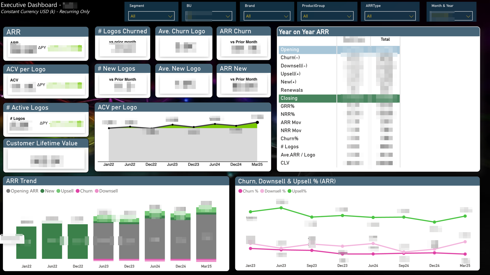
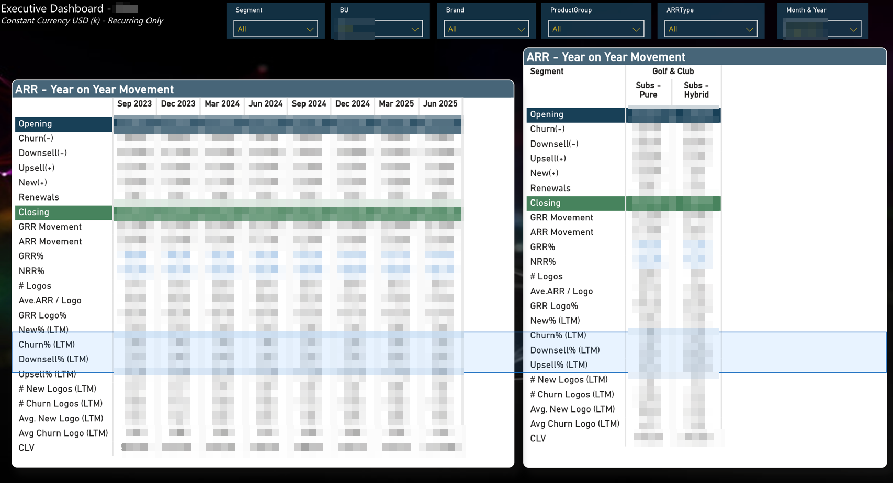

# Azure-Fabric Data Pipeline for Power BI

This repository demonstrates an end-to-end data pipeline using **Azure Function App**, **Azure Blob Storage**, and **Microsoft Fabric** to automate data ingestion, transformation, and visualization in Power BI.

---

## Overview

The project automates the full reporting process from ingestion to visualization.  
Daily data exports from a source system are captured by Azure Functions, processed in Microsoft Fabric, and visualized in Power BI.  
The solution replaces manual reporting workflows with a scalable, reliable, and automated pipeline.

---

## Architecture

**Flow:**  
Azure Function → Azure Blob Storage → Fabric Lakehouse (Bronze/Silver/Gold) → Fabric Warehouse → Power BI Dataflow → Power BI Dashboard

---

## Objectives

- Automate daily data ingestion and eliminate manual exports  
- Support incremental and late-arriving data through merge/upsert logic  
- Maintain data quality and lineage from raw ingestion to visualization  
- Enable scalable analytics across multiple reporting datasets  

---

## Components

### 1. Azure Function (Ingestion Layer)
Retrieves JSON exports from a source system and writes them to Azure Blob Storage.  
[Code → `azure/function-app/__init__.py`](azure/function-app/__init__.py)

### 2. Azure Blob Storage (Staging Layer)
Serves as the initial landing zone for ingested data, organized into folders such as `/daily`, `/initial`, and `/corrections`.  
Includes lifecycle management policies.  
[Policy → `azure/storage-lifecycle-policy.json`](azure/storage-lifecycle-policy.json)

### 3. Microsoft Fabric Lakehouse (Transformation Layer)
Processes raw data in three stages:
- **Bronze**: Raw ingestion from JSON files  
- **Silver**: Cleansed, deduplicated, and standardized data  
- **Gold**: Curated tables ready for analytics  
[Scripts → `fabric/`](fabric/)

### 4. Microsoft Fabric Warehouse (Computation Layer)
Aggregates and computes summary tables for reporting.  
[SQL Script → `fabric/summary-table.sql`](fabric/summary-table.sql)

### 5. Power BI (Visualization Layer)
Connects to Fabric Gold tables via Dataflow Gen2 to generate dashboards.  
[Power Query → `fabric/Dataflow.pq`](fabric/Dataflow.pq)

## Power BI Modeling & Query Layer

This layer connects curated **Gold** and **Warehouse** tables from Microsoft Fabric to Power BI through **Dataflow Gen2**, enabling a semantic model that supports consistent KPIs and efficient refresh operations.

| Resource | Description |
|-----------|--------------|
| [Sample DAX Measures](powerbi/modeling/sample_dax_measures.md) | Core business calculations used in Power BI reports (e.g., Total Settlement, Interchange %, Transaction Cost Margin, YoY ARR Growth). |
| [Sample Power Query (M)](powerbi/modeling/sample_powerquery_m.md) | Dataflow Gen2 query examples demonstrating filtering, shaping, and incremental refresh logic. |
| [Dataflow Query Montage](powerbi/modeling/dataflow_queries.png) | Visual overview of Power BI dataflows connecting to Fabric Lakehouse and Warehouse tables. |

Each resource demonstrates how the reporting model integrates with Microsoft Fabric’s transformation layers while maintaining semantic consistency and reusable logic across dashboards.

---

## Example Dashboards

| Dashboard | Description |
|------------|--------------|
|  | Executive-level KPIs and trends |
|  | Detailed financial or operational analysis |
|  | Entity-level or regional performance |

---

## Key Benefits

- Fully automated ingestion and transformation  
- Consistent, auditable data lineage  
- Scalable design for large datasets  
- Seamless integration between Azure, Fabric, and Power BI  

---

## Risks and Mitigation

| Risk | Mitigation |
|------|-------------|
| Source data delivery issues | Implement monitoring and alerts in Fabric pipelines |
| Schema drift in JSON files | Handle schema changes dynamically with Spark or Data Factory |
| Data growth or duplication | Use merge/upsert logic and lifecycle policies |

---

## Next Steps

- Deploy and validate the Azure Function and Blob connection  
- Configure Fabric ingestion and transformation workflows  
- Establish daily pipeline scheduling and monitoring  
- Connect Power BI dataflows to Fabric Gold tables  

---

## Related Documents

- [Proposal Summary](docs/proposal-summary.md)  
- [Data Lineage View](docs/lineage-view.png)  
- [Lessons Learned](docs/lessons-learned.md)
